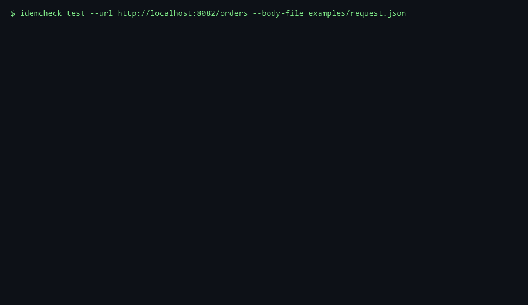
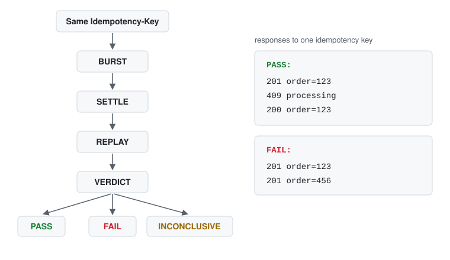

# IdemCheck

[](https://github.com/hyukvoid/idemcheck/actions/workflows/ci.yml)
[](https://github.com/hyukvoid/idemcheck/blob/main/go.mod)
[](LICENSE)
[](https://github.com/hyukvoid/idemcheck/releases/latest)

**Catch Idempotency-Key races before they become duplicate operations.**

A small CLI for black-box testing the observable HTTP `Idempotency-Key`
contract under retries and concurrent duplicates.

```text
$ idemcheck test --url http://localhost:8082/orders --body-file examples/request.json

Sequential retry ×2 ....................... PASS
Sequential retry ×10 ...................... PASS
Concurrent retry ×10 ...................... FAIL
...
11 concurrent requests
1 idempotency key
10 distinct logical results
...
Differing fields:
  $.order_id
Result:
FAIL
```

<p align="center">
  
</p>

> IdemCheck tests what can be observed over HTTP. A PASS does not prove
> that hidden side effects such as database writes, message publishes,
> emails, or payment captures happened exactly once.

Built for APIs you're authorized to test, including third-party, partner, and
vendor APIs whose internals you cannot inspect. It also serves as an external
contract check on your own services.

## The bug it catches

Many APIs deduplicate with a check-then-do sequence:

```text
check key
  ↓
work
  ↓
create resource
  ↓
store key
```

Two requests can both pass the check before either stores the result. Both
run the work, and the API creates two resources where callers expect one.

A sequential retry test never overlaps the two:

```text
request A        → one result
request A again  → same result
```

Released together, ten requests can all pass the check first:

```text
10 requests released together
same Idempotency-Key
→ multiple logical results
```

IdemCheck runs these patterns against a live endpoint and compares what
comes back. Divergent bodies for one key mean `FAIL`, with the differing
fields named in the report. The demo APIs in this repo implement both the
racy and the synchronized pattern.

## Install

```bash
go install github.com/hyukvoid/idemcheck/cmd/idemcheck@v1.0.0
```

`@latest` follows future releases:

```bash
go install github.com/hyukvoid/idemcheck/cmd/idemcheck@latest
```

Both were verified against the public Go module proxy; the pinned build
reports `IdemCheck v1.0.0`.

Prebuilt binaries for Windows, Linux, and macOS are available on the
[Releases](https://github.com/hyukvoid/idemcheck/releases) page (amd64 and
arm64, with `SHA256SUMS`).

Test an API you're authorized to use:
```bash
idemcheck test \
  --url https://staging.example.com/orders \
  --body-file request.json \
  -H "Authorization: Bearer $TOKEN" \
  --allow-remote
```

Use `--allow-remote` only on environments you're authorized to test.

## Quick start

The repository ships two toy order APIs: a safe one on `:8081` (per-key
mutex) and an unsafe one on `:8082` (check, work, insert, store).

```bash
git clone https://github.com/hyukvoid/idemcheck
cd idemcheck
docker compose -f examples/docker-compose.yml up -d
```

Against the unsafe API, expect `FAIL` (exit `1`):

```bash
idemcheck test \
  --url http://localhost:8082/orders \
  --body-file examples/request.json
```

```text
Sequential retry ×2 ....................... PASS
Sequential retry ×10 ...................... PASS
Concurrent retry ×10 ...................... FAIL
  BURST: 10 requests released together (spread 0 ms)
  SETTLE: 250ms before replay
  REPLAY: 1 request -> HTTP 201 (confirmed a logical result)
  VERDICT: 10 distinct logical results for one idempotency key: response bodies diverge
Same key + changed payload ................ PASS
Different key + same payload .............. PASS
...
RACE CONDITION DETECTED
...
Differing fields:
  $.order_id
Result:
FAIL

Concurrency trials: 1 observed
```

Against the safe API, expect `PASS (observed)` (exit `0`):

```bash
idemcheck test \
  --url http://localhost:8081/orders \
  --body-file examples/request.json
```

```text
Sequential retry ×2 ....................... PASS
Sequential retry ×10 ...................... PASS
Concurrent retry ×10 ...................... PASS
  BURST: 10 requests released together (spread 0 ms)
  SETTLE: 250ms before replay
  REPLAY: 1 request -> HTTP 201 (confirmed a logical result)
  VERDICT: 11 requests converged on 1 logical result (replay agreed)
...
Result:
PASS (observed)

Concurrency trials: 1 observed
```

Stop the demo:

```bash
docker compose -f examples/docker-compose.yml down
```

> **PowerShell:** pass the body with `--body-file`; PowerShell mangles
> inline `--body` JSON quoting.

## How IdemCheck works

A concurrent check moves through four phases:

<p align="center">
  
</p>

- `BURST` releases `--concurrency` requests (default `10`) from a single
  process at the same moment, all carrying the same key.
- `SETTLE` waits `--settle` (default `250ms`). The wait is configuration, not
  a discovered completion boundary: raise it for APIs with slow asynchronous
  processing.
- `REPLAY` re-sends the original request with the same key, bounded by
  `--replay-timeout` (default `5s`).
- `VERDICT` decides from HTTP-visible convergence and states its evidence.

The burst is single-process and client-side: one process releases its own
workers together. It does not model every WAN, cross-region, multi-client,
or load-balancer timing pattern (see Limitations).

A run performs five checks:

| Check | Requests | PASSes when |
|---|---|---|
| Sequential retry ×2 | Same key, one after another | One logical result |
| Sequential retry ×10 | Same key, one after another | One logical result |
| Concurrent retry ×10 | Same key, barrier-released, settled, replayed | Every observed 2xx body is one logical result |
| Same key + changed payload | Same key, different body | The conflict is rejected (4xx) or the original result is replayed |
| Different key + same payload | Two keys, same body (control) | The endpoint treats the keys as distinct |

Each check derives its own idempotency key, so scenarios cannot contaminate
one another. A rejected baseline (HTTP ≥ 400) errors the run out with exit
`2` instead of guessing. Evidence that cannot decide a question reports
`INCONCLUSIVE` (exit `3`), never a pass.

Responses compare as semantic fingerprints, not raw bytes:

```text
HTTP response → parse → drop ignored JSON paths → canonical JSON
             → + status + filtered headers → SHA-256
```

Key order never matters. Noise headers (`date`, `x-request-id`,
`traceparent`, `x-amzn-trace-id`, `cf-ray`, `server-timing`) are ignored by
default. Non-JSON bodies fall back to normalized raw comparison, and
malformed JSON never crashes the run.

Two profiles decide what counts as an acceptable transient:

- `safe-retry` (default): `409`, `429`, `503` are policy transients. A
  transient joins a pass only when the replay answers with a logical result
  that matches the burst.
- `strict-replay`: no transients. Any non-success response in a same-key
  check drives the verdict to `INCONCLUSIVE` rather than a pass.

Pick a profile with `--policy`, override the set with
`--transient-status 429,503`. Statuses outside the profile are never
guessed; they mean `INCONCLUSIVE`.

Repeat the burst with isolated per-trial keys when the race window is
timing-sensitive:

```bash
idemcheck test --url http://localhost:8082/orders \
  --body-file examples/request.json --trials 3
```

```text
  BURST: 10 requests × 3 trials (isolated per-trial keys)
  SETTLE: 250ms × 3 trials
  REPLAY: 3/3 confirmed a logical result
  VERDICT: Concurrency race detected in 3 / 3 trials
```

A failing run reports `Concurrency race detected in N / M trials`, a clean
one `No observable race in N trials`. Both are observations; no trial count
proves a race does not exist. The result block always states
`Concurrency trials: N observed`, and `--max-trials` (default `10`) bounds
the run.

One optional fault scenario: `--fault lost-response` wraps the target in a
loopback-only proxy that drops exactly one completed response (the request
still runs upstream), so you can watch a lost response become
`INCONCLUSIVE` instead of a wrong verdict:

```text
Sequential retry ×2 ....................... INCONCLUSIVE
  VERDICT: 1/2 requests failed before a verdict: Post "...": EOF
```

## Verdicts

| Verdict | Meaning | Exit |
|---|---|---|
| `PASS` | No violation observed in the configured HTTP-visible checks. | `0` |
| `FAIL` | Concrete observable idempotency divergence. | `1` |
| `ERROR` | Execution or configuration failure; nothing usable observed. | `2` |
| `INCONCLUSIVE` | The tool observed something it cannot safely classify. | `3` |

Precedence when several apply: `1 > 2 > 3 > 0`.

The terminal prints a pass as `PASS (observed)`, with any active exclusions
and the trial count listed underneath. That label is presentation; the
machine contract stays exact. `summary.result` in JSON is one of `PASS`,
`FAILED`, `ERROR`, `INCONCLUSIVE` and always matches the exit code.

## Why not curl / k6 / hey / vegeta?

Traffic generators send requests. IdemCheck decides whether same-key retries\
converged on one observable result.

Those tools are good at sending traffic and measuring it. None of them asks
the idempotency question: do duplicate requests sharing one key still
converge on one logical result?

IdemCheck adds the idempotency-specific behavior:

- same-key scenarios: sequential retries, a concurrent burst, a payload
  conflict, and a different-key control
- a synchronized burst, settle window, and same-key replay, ending in a
  stated verdict with its evidence
- semantic normalization, so key order, noise headers, and ignored fields
  never create or hide a divergence
- payload and key contract checks
- `INCONCLUSIVE` instead of a guess, plus which fields differed, each
  fingerprint's values, and a copy-pasteable re-run
- loopback-only defaults, credential redaction, and CI exit codes
  `0`/`1`/`2`/`3` with a JSON document that matches them

A short custom script can cover simple cases. IdemCheck exists so teams do
not have to rebuild the edge cases, reporting, safety, and convergence
logic every time.

## Common usage

```bash
# Authenticated endpoint
idemcheck test \
  --url http://localhost:8080/orders \
  --body-file request.json \
  -H "Authorization: Bearer $TOKEN"

# Deterministic re-run of a reported failure
idemcheck test --url http://localhost:8082/orders \
  --body-file examples/request.json \
  --key idemcheck-88ce449cded4

# Config file + verbose timings
idemcheck test --config examples/idemcheck.yaml \
  --url http://localhost:8081/orders \
  --body-file examples/request.json --verbose

# Heavier burst (capped by --max-concurrency)
idemcheck test --url http://localhost:8082/orders \
  --body-file examples/request.json --concurrency 25 --repeat 20

# Three isolated trials; report a race ratio
idemcheck test --url http://localhost:8082/orders \
  --body-file examples/request.json --trials 3

# Strict evidence: no policy transients accepted
idemcheck test --url http://localhost:8081/orders \
  --body-file examples/request.json --policy strict-replay
```

Common flags:

| Flag | Default | Purpose |
|---|---|---|
| `--url` | required | target URL |
| `--method` | `POST` | HTTP method |
| `--body` / `--body-file` | (none) | request body, inline or from file |
| `--key` / `--key-header` | generated / `Idempotency-Key` | idempotency key and header name |
| `--concurrency` | `10` | burst size; ceiling `--max-concurrency` (default `50`) |
| `--repeat` | `10` | sequential repeats; ceiling `--max-repeat` (default `100`) |
| `--trials` / `--max-trials` | `1` / `10` | isolated bursts, each with its own key |
| `--settle` | `250ms` | wait between burst and replay |
| `--replay-timeout` | `5s` | replay budget |
| `--timeout` | `10s` | per-request HTTP timeout |
| `--max-body-bytes` | `4194304` | response read limit; larger bodies go `INCONCLUSIVE` |
| `--policy` | `safe-retry` | `safe-retry` or `strict-replay` |
| `--transient-status` | profile set | override acceptable transients |
| `--format` | `text` | `text` or `json` |
| `--ignore-json` / `--ignore-header` | (none) | response exclusions (see Safety) |
| `--allow-remote` | off | permit a non-local target |
| `--fault` | `none` | `lost-response` fault scenario |
| `--verbose` | off | per-request timing detail |
| `--config` | (none) | YAML config file |

`idemcheck test --help` prints every flag with its full description.

## JSON / CI

```bash
idemcheck test \
  --url http://localhost:8082/orders \
  --body-file examples/request.json \
  --format json > idemcheck.json
echo "exit=$?"   # 0 pass, 1 violation, 2 error, 3 inconclusive
```

`summary`, trimmed from a real run:

```json
{
  "result": "FAILED",
  "exit_code": 1,
  "checks_passed": 4,
  "checks_failed": 1,
  "checks_inconclusive": 0,
  "checks_skipped": 0,
  "policy": "safe-retry",
  "trials": 1
}
```

The document also carries `checks`, `violations` (with `differing_fields`),
`evidence` fingerprint groups, a ready-to-paste `reproduce.command`,
per-check `phases` (`BURST` / `SETTLE` / `REPLAY` / `VERDICT`), `trials`,
and the active `ignore_json` / `ignore_headers` exclusions.

In CI, treat exit `1` as a test failure, `2` as a configuration problem, and
`3` as "the run could not decide", never as a pass.

## Safety

### Remote guard

IdemCheck sends duplicate POSTs on purpose, so it refuses non-local targets
unless you opt in:

```console
$ idemcheck test --url http://api.example.invalid/orders --body-file examples/request.json
Error: refusing to test non-local target "api.example.invalid": this tool intentionally sends duplicate POST requests.
Re-run with --allow-remote if api.example.invalid is a test/staging environment you own
```

That exits `2` before any request is sent. `localhost`, `127.0.0.0/8`, and
`::1` always work. `--allow-remote` proceeds after a loud warning; pass it
only to test or staging systems you own. Two ceilings bound the blast
radius: `--max-concurrency` (default `50`) and `--max-repeat` (default
`100`). Credentials are redacted from every output path; add more names
with `--sensitive-header`.

### Ignore rules

Ignore rules silence volatile fields before fingerprinting:

```yaml
# examples/idemcheck.yaml
response:
  ignore_json:
    - $.request_id
    - $.timestamp
  ignore_headers:
    - x-custom-trace
```

Paths use JSONPath-style prefixes (`$.request_id`, `$.meta.trace_id`,
`$.items[*].ts`). Matched object keys are deleted; matched array elements
become `null` so array shape stays comparable. The same rules work as flags:
`--ignore-json '$.request_id' --ignore-header x-custom-trace`.

> **Ignore rules weaken observation.** No field name is inherently safe:
> an ignored field can carry business identity, and IdemCheck does not
> guess which fields to trust. Ignoring `$.order_id` on the unsafe demo
> turns the race check from `FAIL` into `PASS`; the different-key control
> then degrades to `INCONCLUSIVE` (distinct keys look identical), so the
> run as a whole reports `INCONCLUSIVE` (exit `3`), not a pass. Every
> `PASS` result block lists the active exclusions verbatim; review them as
> carefully as the test itself.

## Limitations

- **Response-level scope.** Observable HTTP behavior only. Database rows,
  queue messages, emails, payments, and other side effects are outside its
  view; it never inspects your storage or consumers.
- **Passing is evidence, not proof.** A `PASS` means these runs observed
  one semantic response, not that no interleaving could produce two.
  `--trials N` narrows the question ("No observable race in N trials")
  without proving absence.
- **One process, one client.** The barrier creates a single-process,
  client-side burst. It does not reproduce cross-region retries, WAN
  jitter, multi-client clock differences, every staggered retry pattern, or
  every load-balancer scheduling pattern, and `--trials` repeats the
  observation without changing any of that.
- **Hidden side effects stay hidden.** Internal work that never changes an
  HTTP response is invisible to any black-box checker (fixture J in
  [docs/TEST_MATRIX.md](docs/TEST_MATRIX.md)).
- **Structural detection.** Differing fields come from structural JSON diff.
  A resource ID embedded in an unstructured text string cannot be named as
  a differing field; the fingerprint still differs and the check still
  fails, but the report shows fingerprint-level evidence only.
- **Ignore rules can hide failures.** See the warning above.

## Architecture

```text
cmd/idemcheck/        CLI entry point
internal/cli/         flag parsing + terminal rendering
internal/config/      options, safety guard, YAML config, policy profiles
internal/engine/      sequential + barrier runners, replay, trials, scenarios
internal/fingerprint/ normalization, ignore paths, JSON diff
internal/httpx/       request building, response reading, fault proxy
internal/models/      result schema (JSON contract)
internal/redact/      credential redaction for every output path
internal/report/      assemble + write text/JSON output
internal/buildinfo/   version from Go build info
examples/             safe + unsafe demo APIs, compose file, sample config
docs/                 executed test matrix, release design
integration/          end-to-end tests (unsafe races, safe passes)
```

Workers prepare first, then release together; results land in per-worker
slots so the hot path takes no locks. Every scenario derives its own key
from the base key, so checks stay isolated.

## Development

```bash
gofmt -l .
go vet ./...
go test ./...
go test -race ./...
go build ./...
```

Build from source:

```bash
git clone https://github.com/hyukvoid/idemcheck
cd idemcheck
go build -o bin/idemcheck ./cmd/idemcheck
```

`go test ./...` executes the reference fixtures A–J on every run; their
expected verdicts and the false-positive / false-negative contract live in
[docs/TEST_MATRIX.md](docs/TEST_MATRIX.md).

See [CONTRIBUTING.md](CONTRIBUTING.md) for the full development loop and
[docs/RELEASE.md](docs/RELEASE.md) for the release design.

Issues and pull requests are welcome:
[bug report](https://github.com/hyukvoid/idemcheck/issues/new?template=bug_report.md) ·
[feature request](https://github.com/hyukvoid/idemcheck/issues/new?template=feature_request.md) ·
[security policy](SECURITY.md)

## License

[MIT](LICENSE)
