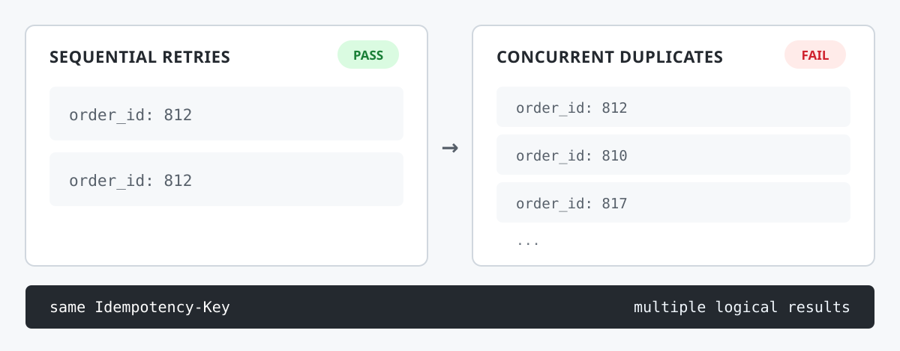

# IdemCheck

[](https://github.com/hyukvoid/idemcheck/actions/workflows/ci.yml)
[](https://github.com/hyukvoid/idemcheck/blob/main/go.mod)
[](LICENSE)
[](https://github.com/hyukvoid/idemcheck/releases/latest)

**Catch Idempotency-Key races before they become duplicate operations.**

A small CLI for black-box testing of the observable HTTP `Idempotency-Key`
contract under retries and concurrent duplicates. Use it on APIs you're
authorized to test, including third-party, partner, and vendor APIs whose
internals you cannot inspect.

<p align="center">
  
</p>

```text
Sequential retry ×2 ....................... PASS
Concurrent retry ×10 ...................... FAIL
11 concurrent requests
1 idempotency key
10 distinct logical results
Differing fields:
  $.order_id
Result:
FAIL
```

<p align="center">
  
</p>

> A `PASS` means no violation was observed through HTTP. It does not prove
> that hidden database, message, email, or payment side effects happened
> exactly once.

## The bug it catches

An unsafe implementation checks for a key, does the work, creates the
resource, then stores the result:

```text
check key
  ↓
work
  ↓
create resource
  ↓
store key
```

Two requests can pass the check before either stores a result. Both perform
the operation, so callers may receive different resources.

A sequential retry checks this path:

```text
request A        → one result
request A again  → same result
```

It does not overlap the requests. A burst can:

```text
10 requests released together
same Idempotency-Key
→ multiple logical results
```

IdemCheck compares the HTTP responses and names differing JSON fields such
as `$.order_id`.

## Install

Install the pinned release:

```bash
go install github.com/hyukvoid/idemcheck/cmd/idemcheck@v1.0.0
```

To install the latest published version:

```bash
go install github.com/hyukvoid/idemcheck/cmd/idemcheck@latest
```

Prebuilt binaries for Windows, Linux, and macOS are on the
[Releases](https://github.com/hyukvoid/idemcheck/releases) page (amd64 and
arm64, with `SHA256SUMS`).

Test an API you're authorized to use:

```bash
idemcheck test \
  --url https://staging.example.com/orders \
  --body-file request.json \
  -H "Authorization: Bearer $TOKEN" \
  --allow-remote
```

Use `--allow-remote` only on environments you're authorized to test.

## 60-second demo

The compose file starts a safe API on `:8081` (per-key mutex) and an unsafe
API on `:8082` (check, work, insert, store).

```bash
docker compose -f examples/docker-compose.yml up -d
```

The unsafe API exposes the race (exit `1`):

```bash
idemcheck test \
  --url http://localhost:8082/orders \
  --body-file examples/request.json
```

Expect `FAIL` on the concurrent retry. Try the safe API (exit `0`):

```bash
idemcheck test \
  --url http://localhost:8081/orders \
  --body-file examples/request.json
```

Expect `PASS (observed)`. Stop the demo when you're done:

```bash
docker compose -f examples/docker-compose.yml down
```

## How it works

<p align="center">
  
</p>

`BURST` releases the default 10 requests together. `SETTLE` waits 250ms.
`REPLAY` sends the original request again within 5s. `VERDICT` reports the
HTTP-visible result and its evidence.

## Verdicts

| Verdict | Meaning | Exit |
|---|---|---|
| `PASS` | No violation observed in the configured HTTP-visible checks. | `0` |
| `FAIL` | Concrete observable idempotency divergence. | `1` |
| `ERROR` | Execution or configuration failure; nothing usable observed. | `2` |
| `INCONCLUSIVE` | The tool observed something it cannot safely classify. | `3` |

## Why not curl / k6 / hey / vegeta?

Traffic generators send requests. IdemCheck evaluates whether same-key
requests converge on one observable result. A short custom script can cover
a one-off case; IdemCheck includes retries, concurrency checks, and evidence
reporting for repeated use.

## Safety

- Targets are loopback-only by default. Remote tests need `--allow-remote`,
  which sends duplicate requests and prints a warning.
- Use `--allow-remote` only for environments you're authorized to test.
- `--max-concurrency` defaults to 50 and `--max-repeat` to 100. Credentials
  are redacted from output; add names with `--sensitive-header`.

## Limitations

- The burst runs in one process. It does not reproduce every WAN,
  cross-region, multi-client, or load-balancer timing pattern.
- Differing fields come from structural JSON comparison. An ID inside a
  plain-text body changes the fingerprint, but the report cannot name that
  field.

## Full reference

Advanced policies, trials, JSON/CI output, ignore rules, fault scenarios, and
package layout are in [docs/REFERENCE.md](docs/REFERENCE.md).

## Development

Before submitting changes:

```bash
gofmt -l .
go vet ./...
go test ./...
go test -race ./...
go build ./...
```

See the [test matrix](docs/TEST_MATRIX.md) for the expected behaviors covered
by the test suite. To build an executable:

```bash
go build -o bin/idemcheck ./cmd/idemcheck
```

## Contributing

See [CONTRIBUTING.md](CONTRIBUTING.md) for the development loop.
Report issues with a [bug report](https://github.com/hyukvoid/idemcheck/issues/new?template=bug_report.md)
or [feature request](https://github.com/hyukvoid/idemcheck/issues/new?template=feature_request.md).
The [security policy](SECURITY.md) explains how to report a vulnerability.

## License

[MIT](LICENSE)
